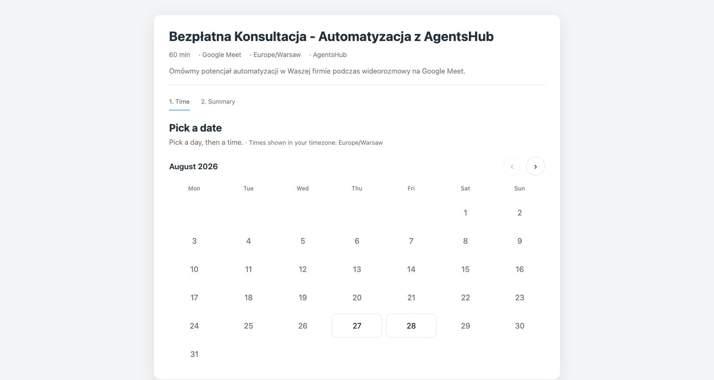
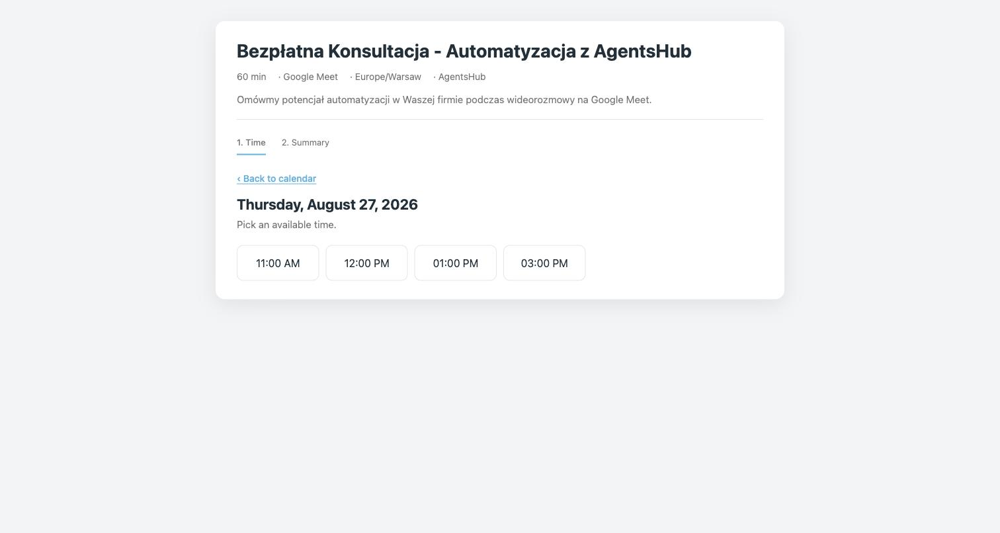
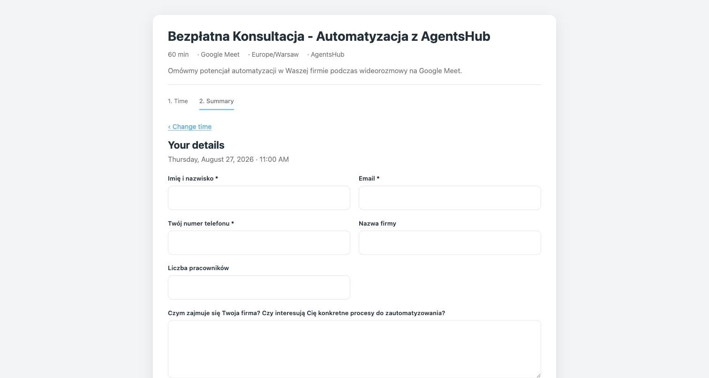

# laravel-booking

**Self-hosted booking widget for Laravel.** A drop-in Calendly / Zencal replacement when all you need is scheduling and you want to own the data, the look, and the form.

- One `<script>` tag embeds the widget on any page (Blade, Twig / October CMS, static HTML, anything)
- Availability is computed from **weekly windows in config** minus **busy time on your real calendar**
- Works with **Google Calendar**, **Microsoft 365 / Outlook**, and any **CalDAV** server (iCloud, Nextcloud, Fastmail, Radicale)
- Video links via **Google Meet**, **Microsoft Teams**, or **Zoom**; or a static location (office address, phone)
- Confirmation, reschedule, and cancellation emails with `.ics` attachments, in English and Polish
- Reschedule / cancel links are HMAC-signed, so **no database table is required**
- Optional **Slack** notification on every booking
- Pre-fill and lock form fields from `data-*` attributes (perfect for multi-step funnels)
- Multiple availability windows per weekday, buffers, minimum notice, maximum advance
- Config-driven. No admin panel, no vendor lock-in, MIT licensed

<p align="center">
  
</p>
<p align="center">
  
</p>
<p align="center">
  
</p>

## Contents

- [Requirements](#requirements)
- [Installation](#installation)
- [Quick start](#quick-start)
- [Calendar providers](#calendar-providers)
  - [Google Calendar](#google-calendar)
  - [Microsoft 365 / Outlook](#microsoft-365--outlook)
  - [CalDAV (iCloud, Nextcloud, Fastmail)](#caldav-icloud-nextcloud-fastmail)
- [Meeting locations](#meeting-locations)
  - [Google Meet](#google-meet)
  - [Microsoft Teams](#microsoft-teams)
  - [Zoom](#zoom)
  - [Custom location](#custom-location)
- [Event types](#event-types)
- [Embedding the widget](#embedding-the-widget)
- [Emails](#emails)
- [Slack notifications](#slack-notifications)
- [Events for host applications](#events-for-host-applications)
- [HTTP API](#http-api)
- [Optional bookings table](#optional-bookings-table)
- [Configuration reference](#configuration-reference)
- [Extending: writing your own provider](#extending-writing-your-own-provider)
- [Testing](#testing)
- [Contributing](#contributing)
- [License](#license)

## Requirements

- PHP 8.0+
- Laravel 9, 10, 11, 12, or 13 (also works inside October CMS, which ships the Laravel container)
- A mail transport configured in your app (`MAIL_*`)
- An account on at least one supported calendar provider

## Installation

```bash
composer require zapol/laravel-booking
php artisan vendor:publish --tag=booking-config
```

The package auto-registers its service provider, routes (under `/booking`), views, and translations.

Optional publishes:

```bash
php artisan vendor:publish --tag=booking-views       # customise email templates
php artisan vendor:publish --tag=booking-assets      # copy widget.js into public/vendor/booking
php artisan vendor:publish --tag=booking-migrations  # optional bookings table (see below)
```

## Quick start

1. Pick a calendar provider and add its env keys (Google is the default, see below).
2. Set who organises the meetings:

   ```env
   BOOKING_ORGANIZER_NAME="Jane Doe"
   BOOKING_ORGANIZER_EMAIL=jane@example.com
   BOOKING_ORGANIZER_TZ=Europe/Warsaw

   BOOKING_MAIL_FROM=noreply@example.com
   BOOKING_MAIL_FROM_NAME="Example Inc"
   ```

3. Define an event type in `config/booking.php` (one is included, called `consultation`).
4. Embed it:

   ```html
   <div id="booking-widget"></div>
   <script src="https://your-app.tld/booking/widget.js" data-event-type="consultation" defer></script>
   ```

5. Open `https://your-app.tld/booking/embed?event_type=consultation` to see it standalone.

## Calendar providers

Set the driver once:

```env
BOOKING_CALENDAR_DRIVER=google    # google | microsoft | caldav
```

The driver decides two things: **where busy time is read from** (to compute free slots) and **where the booking event is written** (with the attendee invited). Everything else, the widget, emails, tokens, is provider-agnostic.

### Google Calendar

Default driver. Uses OAuth 2.0 with a refresh token minted once through a small built-in web UI.

```env
BOOKING_CALENDAR_DRIVER=google
BOOKING_GOOGLE_CLIENT_ID=...
BOOKING_GOOGLE_CLIENT_SECRET=...
BOOKING_GOOGLE_REFRESH_TOKEN=...
BOOKING_GOOGLE_CALENDAR_ID=primary
```

Instead of `CLIENT_ID` / `CLIENT_SECRET` you can point at the JSON file downloaded from Google Cloud Console:

```env
BOOKING_GOOGLE_CREDENTIALS_FILE=/var/www/app/google_oauth.json
```

**One-time authorisation:**

1. Run `php artisan booking:google-auth`. It prints a signed link to `/booking/google/connect` (valid 60 minutes) and the redirect URI you must register (`https://your-app.tld/booking/google/callback`).
2. In [Google Cloud Console > Credentials](https://console.cloud.google.com/apis/credentials) create an **OAuth 2.0 Client ID** of type **Web application**, add that redirect URI, and enable the [Google Calendar API](https://console.cloud.google.com/apis/library/calendar-json.googleapis.com).
3. Put the client id + secret in `.env`, run `php artisan config:clear`.
4. Open the signed link, click **Connect Google Account**, sign in with the account that owns the calendar. The callback page shows `BOOKING_GOOGLE_REFRESH_TOKEN=...`; paste it into `.env` and run `php artisan config:clear` again.

Each install can use a different Google account. Nothing is persisted server-side; the refresh token lives only in your `.env`.

Native conference: **Google Meet** (`'location' => 'google_meet'`).

### Microsoft 365 / Outlook

Uses Microsoft Graph with an app-only (client credentials) token, so there is no interactive login. Works with Microsoft 365 and Exchange Online mailboxes.

```env
BOOKING_CALENDAR_DRIVER=microsoft
BOOKING_MS_TENANT_ID=...
BOOKING_MS_CLIENT_ID=...
BOOKING_MS_CLIENT_SECRET=...
BOOKING_MS_USER=jane@contoso.com        # mailbox whose calendar is used
BOOKING_MS_CALENDAR_ID=                 # optional, blank = default calendar
BOOKING_MS_BUSY_SCHEDULES=              # optional, comma-separated extra mailboxes/rooms to treat as busy
```

**Setup in Microsoft Entra (Azure AD):**

1. Entra admin center > App registrations > **New registration**. Any name, single tenant. No redirect URI is needed.
2. Copy the **Application (client) ID** and **Directory (tenant) ID**.
3. Certificates & secrets > **New client secret**. Copy the value (shown once).
4. API permissions > Add a permission > Microsoft Graph > **Application permissions** > `Calendars.ReadWrite` (add `Calendars.Read.Shared` too if you use `BOOKING_MS_BUSY_SCHEDULES` for other mailboxes). Click **Grant admin consent**.
5. Recommended: restrict the app to the one mailbox with an [application access policy](https://learn.microsoft.com/graph/auth-limit-mailbox-access) in Exchange Online PowerShell:

   ```powershell
   New-ApplicationAccessPolicy -AppId <client-id> -PolicyScopeGroupId booking-mailboxes@contoso.com -AccessRight RestrictAccess
   ```

Invites are sent by Exchange automatically when the event is created.

Native conference: **Microsoft Teams** (`'location' => 'teams'`).

### CalDAV (iCloud, Nextcloud, Fastmail)

Talks plain CalDAV over HTTPS with basic auth. Use this for Apple iCloud, Nextcloud, Fastmail, Radicale, Baikal, SOGo, and most self-hosted servers.

```env
BOOKING_CALENDAR_DRIVER=caldav
BOOKING_CALDAV_URL=https://caldav.example.com/calendars/jane/personal/
BOOKING_CALDAV_USERNAME=jane
BOOKING_CALDAV_PASSWORD=app-specific-password
BOOKING_CALDAV_BUSY_URLS=              # optional, comma-separated extra collection URLs that count as busy
```

`BOOKING_CALDAV_URL` must be the **calendar collection URL** (it ends with a slash), not the server root. How to find it:

| Server | Where to look |
|---|---|
| **iCloud** | Create an [app-specific password](https://support.apple.com/102654). The URL looks like `https://pXX-caldav.icloud.com/<dsid>/calendars/<calendar-id>/`. Easiest way: open the calendar in a CalDAV client such as Thunderbird, or run a `PROPFIND` on `https://caldav.icloud.com/` with your Apple ID to discover the principal and its `calendar-home-set`. |
| **Nextcloud** | Calendar app > three dots next to the calendar > **Copy private link** / "Edit" shows the CalDAV URL: `https://cloud.example.com/remote.php/dav/calendars/<user>/<calendar>/`. Use an app password from Settings > Security. |
| **Fastmail** | Settings > Privacy & Security > Integrations > **New app password** (Calendars). URL: `https://caldav.fastmail.com/dav/calendars/user/<you@fastmail.com>/<calendar-id>/`. |
| **Radicale / Baikal** | The collection URL shown in the admin UI, e.g. `https://dav.example.com/jane/<uuid>/`. |

The driver stores events in UTC and lists attendees on the event. Whether the attendee receives a native calendar invite depends on the server's scheduling support (iCloud and Nextcloud do send invites; Radicale does not). The package always sends its own confirmation email with an `.ics` attachment, so attendees get the event either way.

Recurring events are expanded server-side (`expand` in the `calendar-query` report), so repeating busy blocks are respected.

Native conference: none. Combine with [Zoom](#zoom) or a [custom location](#custom-location).

## Meeting locations

Each event type declares a `location`. It controls the conference link that ends up on the calendar event, in the emails, and on the widget's confirmation screen.

| `location` | What happens | Requires |
|---|---|---|
| `google_meet` | Google creates a Meet link on the event | `google` driver |
| `teams` | Exchange creates a Teams meeting on the event | `microsoft` driver |
| `zoom` | A Zoom meeting is created and its join URL is stored on the event | Zoom S2S app (any driver) |
| `custom` | Static `location_url` and/or `location_text` | nothing |
| `null` | No location | nothing |

If an event type asks for a native conference the active driver cannot create (for example `google_meet` with the `caldav` driver), a warning is logged and the event is created without a link.

### Google Meet

```php
'location' => 'google_meet',
```

### Microsoft Teams

```php
'location' => 'teams',
```

### Zoom

Zoom is a **conference provider**, independent of the calendar driver, so it works with Google, Microsoft, or CalDAV calendars. Meetings are created through a [Server-to-Server OAuth app](https://developers.zoom.us/docs/internal-apps/s2s-oauth/).

```env
BOOKING_ZOOM_ACCOUNT_ID=...
BOOKING_ZOOM_CLIENT_ID=...
BOOKING_ZOOM_CLIENT_SECRET=...
BOOKING_ZOOM_USER=me            # or the host's email / user id
```

Setup: [Zoom App Marketplace](https://marketplace.zoom.us/) > Develop > **Build App** > **Server-to-Server OAuth**. Copy Account ID, Client ID, Client Secret. Under Scopes add `meeting:write:admin` (or `meeting:write:meeting:admin` on granular scopes) and `meeting:read:admin`, then **Activate** the app.

```php
'location' => 'zoom',
```

Rescheduling moves the Zoom meeting; cancelling deletes it. The Zoom meeting id travels inside the signed reschedule token, so still no database is needed.

### Custom location

```php
'location'      => 'custom',
'location_text' => 'Our office, Main St 1, Warsaw',   // shown as the location
'location_url'  => 'https://maps.app.goo.gl/...',      // optional, becomes the "join" link
```

Use `location_text` alone for phone calls or in-person meetings, `location_url` alone for a static video room (Whereby, Jitsi, a permanent Meet link).

## Event types

`config/booking.php`:

```php
'event_types' => [
    'consultation' => [
        'title'                => 'Free Consultation',
        'description'          => 'Let\'s talk about your project on a video call.',
        'duration_minutes'     => 60,
        'location'             => 'google_meet',
        'additional_attendees' => [],        // extra emails invited to every booking
        'min_notice_hours'     => 12,        // earliest bookable slot from now
        'max_advance_days'     => 60,        // how far ahead people can book
        'buffer_minutes'       => 0,         // padding before/after each booking
        'slot_step_minutes'    => 60,        // grid the slots are offered on

        // ISO weekday (1=Mon..7=Sun) => list of [start, end] windows, organiser timezone
        'availability' => [
            1 => [['09:00', '12:00'], ['13:00', '15:00'], ['16:00', '18:00']],
            2 => [['11:00', '15:00']],
            3 => [['09:00', '12:00'], ['14:00', '17:00']],
            4 => [['09:00', '12:00']],
            5 => [['09:00', '14:00']],
        ],

        'form_fields' => [
            ['name' => 'name',        'label' => 'Full name', 'type' => 'text',     'required' => true],
            ['name' => 'email',       'label' => 'Email',     'type' => 'email',    'required' => true],
            ['name' => 'phone',       'label' => 'Phone',     'type' => 'tel',      'required' => false],
            ['name' => 'company',     'label' => 'Company',   'type' => 'text',     'required' => false],
            ['name' => 'description', 'label' => 'Details',   'type' => 'textarea', 'required' => false],
        ],
    ],
],
```

Notes:

- `name` and `email` fields are special: `email` receives the confirmation and is invited to the calendar event; `name` becomes the attendee display name.
- Field types: `text`, `email`, `tel`, `number`, `textarea`.
- Every filled field is written into the calendar event description, so your notes are right on the event.
- Add as many event types as you need; each is another key.

Slot computation, in order: weekly windows -> drop anything before `min_notice_hours` or after `max_advance_days` -> step through each window every `slot_step_minutes` -> remove slots that overlap a busy interval (busy is padded by `buffer_minutes` on both sides). A second free/busy check happens at booking time, so two people cannot grab the same slot.

## Embedding the widget

```html
<div id="booking-widget"></div>
<script
    src="https://your-app.tld/booking/widget.js"
    data-event-type="consultation"
    data-lang="en"
    data-primary="#47b2e4"
    defer></script>
```

Attributes on the script tag:

| Attribute | Purpose |
|---|---|
| `data-event-type` | Event type slug (required) |
| `data-lang` | `en` or `pl` (defaults to `booking.theme.lang`) |
| `data-primary` | Accent colour |
| `data-name`, `data-email` | Pre-fill the two core fields |
| `data-fields-<name>` | Pre-fill any other form field by its `name` |
| `data-mount` | CSS selector of the mount element (defaults to `#booking-widget`) |
| `data-api` | Override the API base URL (defaults to the script's own origin + `/booking/api`) |
| `data-first-channel`, `data-last-source` | Attribution strings passed through to the `booking:confirmed` event |

Pre-filled fields render **read-only with a small "from previous step" hint**, so the user can verify them but not retype them. This is what makes the widget slot into multi-step funnels: a qualification form on step 1, the calendar on step 2, no data re-entered.

### Blade

```blade
<script
    src="{{ url('/booking/widget.js') }}"
    data-event-type="consultation"
    data-name="{{ $name }}"
    data-email="{{ $email }}"
    data-fields-company="{{ $company }}"
    defer></script>
<div id="booking-widget"></div>
```

### Twig / October CMS

```twig
<script
    src="/booking/widget.js"
    data-event-type="consultation"
    data-email="{{ form.email|e('html_attr') }}"
    data-fields-company="{{ form.company_name|e('html_attr') }}"
    data-lang="pl"
    defer></script>
<div id="booking-widget"></div>
```

### Standalone page / iframe

`GET /booking/embed?event_type=consultation` renders a bare page with just the widget. Handy for iframes or for testing.

### Analytics

On a successful booking the widget dispatches a DOM event you can hook conversions to:

```js
window.addEventListener('booking:confirmed', function (e) {
    // e.detail = { eventType, payload: { start, end, meet_link, ... }, firstChannel, lastSource }
    gtag('event', 'conversion', { send_to: 'AW-XXXX/YYYY' });
});
```

The widget is vanilla JS with no dependencies and no build step. Edit `resources/js/widget.src.js` and copy it to `resources/dist/widget.js` (they are kept identical).

## Emails

Four mailables, each with an `.ics` attachment so calendar apps stay in sync:

| Mail | To | ICS method |
|---|---|---|
| Confirmation | attendee | `REQUEST` |
| New booking | organiser | `REQUEST` |
| Rescheduled | attendee + organiser | `REQUEST` (same UID, higher sequence) |
| Cancelled | attendee + organiser | `CANCEL` |

Language follows the widget's `data-lang` (stored in the signed token, so reschedule/cancel emails match too). English and Polish ship out of the box; add another locale under `resources/lang/<code>/booking.php`.

Branding without forking templates:

```env
BOOKING_MAIL_LOGO_URL=https://example.com/logo.png
BOOKING_MAIL_BRAND_URL=https://example.com
BOOKING_MAIL_FOOTER_HTML="Example Inc, Main St 1"
BOOKING_MAIL_REPLY_TO=hello@example.com
```

To go further: `php artisan vendor:publish --tag=booking-views` and edit `resources/views/vendor/booking/emails/*.blade.php`. Set `'notify_organizer' => false` to silence organiser copies (you still get the calendar invite).

## Slack notifications

Post a message to a channel on every booking, reschedule, and cancellation:

```env
BOOKING_SLACK_WEBHOOK_URL=https://hooks.slack.com/services/T000/B000/XXXX
```

Create the webhook at [api.slack.com/apps](https://api.slack.com/apps) > your app > **Incoming Webhooks** > Add New Webhook to Workspace. That is the whole setup. Leave the variable empty to disable.

## Events for host applications

Three Laravel events let you wire up CRMs, analytics, or anything else:

```php
use Zapol\Booking\Events\BookingCreated;
use Zapol\Booking\Events\BookingRescheduled;
use Zapol\Booking\Events\BookingCancelled;

Event::listen(BookingCreated::class, function (BookingCreated $e) {
    $e->payload;    // token, event_id, start, end, meet_link, meet_provider, fields, ...
    $e->eventType;  // the event type definition from config
});
```

Listener exceptions are reported and never break the booking.

## HTTP API

All routes live under `booking.route_prefix` (default `booking`). They are stateless and carry no `web` middleware, so they work on hosts without sessions.

| Method | Path | Purpose |
|---|---|---|
| `GET` | `/booking/widget.js` | The widget bundle |
| `GET` | `/booking/embed?event_type=` | Standalone widget page |
| `GET` | `/booking/reschedule/{token}` | Reschedule / cancel page (linked from emails) |
| `GET` | `/booking/api/event-types/{slug}` | Event type metadata + form schema + theme |
| `GET` | `/booking/api/event-types/{slug}/slots?from=&to=` | Available slots (ISO 8601, organiser timezone) |
| `POST` | `/booking/api/bookings` | Create a booking |
| `GET` | `/booking/api/bookings/{token}` | Read a booking by token |
| `POST` | `/booking/api/bookings/{token}/reschedule` | Move it |
| `POST` | `/booking/api/bookings/{token}/cancel` | Cancel it |
| `GET` | `/booking/google/connect` | Google OAuth setup page (signed URL only) |

`POST /booking/api/bookings` body:

```json
{
  "event_type": "consultation",
  "slot": "2026-09-01T09:00:00+02:00",
  "timezone": "Europe/Warsaw",
  "lang": "en",
  "fields": { "name": "Jan Kowalski", "email": "jan@example.com", "company": "Acme" }
}
```

Response `201` includes `token`, `event_id`, `start`, `end`, `meet_link`, `meet_provider`, `location_label`, `html_link`, `reschedule_url`. Errors: `409 slot_no_longer_available`, `422 invalid_fields`, `502 calendar_create_failed`.

Tokens are HMAC-SHA256 over a JSON payload keyed by `APP_KEY`, valid for `booking.token_ttl_days` (default 60). The calendar is the source of truth; the package stores nothing.

## Optional bookings table

If you want an audit log or analytics:

```php
'persist_bookings' => true,
```

```bash
php artisan vendor:publish --tag=booking-migrations
php artisan migrate
```

Purely additive; everything works without it.

## Configuration reference

| Env | Default | Meaning |
|---|---|---|
| `BOOKING_CALENDAR_DRIVER` | `google` | `google`, `microsoft`, `caldav` |
| `BOOKING_ORGANIZER_NAME` | `Organizer` | Shown in the widget and emails |
| `BOOKING_ORGANIZER_EMAIL` | | Receives organiser copies, ICS `ORGANIZER` |
| `BOOKING_ORGANIZER_TZ` | `Europe/Warsaw` | Timezone for availability windows |
| `BOOKING_MAIL_FROM`, `BOOKING_MAIL_FROM_NAME` | `MAIL_FROM_*` | Sender |
| `BOOKING_MAIL_REPLY_TO` | | Reply-To on attendee mails |
| `BOOKING_MAIL_LOGO_URL`, `BOOKING_MAIL_BRAND_URL`, `BOOKING_MAIL_FOOTER_HTML` | | Email branding |
| `BOOKING_GOOGLE_*` | | See [Google Calendar](#google-calendar) |
| `BOOKING_MS_*` | | See [Microsoft 365](#microsoft-365--outlook) |
| `BOOKING_CALDAV_*` | | See [CalDAV](#caldav-icloud-nextcloud-fastmail) |
| `BOOKING_ZOOM_*` | | See [Zoom](#zoom) |
| `BOOKING_SLACK_WEBHOOK_URL` | | See [Slack](#slack-notifications) |

Non-env keys in `config/booking.php`: `route_prefix`, `persist_bookings`, `token_ttl_days`, `theme` (`primary`, `secondary`, `lang`, `ampm`), `mail.notify_organizer`, and `event_types`.

## Extending: writing your own provider

Calendars implement `Zapol\Booking\Contracts\CalendarProvider`:

```php
interface CalendarProvider
{
    public function freeBusy(CarbonImmutable $from, CarbonImmutable $to): array;   // [{start, end}]
    public function createEvent(array $draft): array;                              // {id, html_link, meet_link}
    public function updateEventTime(string $eventId, CarbonImmutable $start, CarbonImmutable $end, string $timezone): void;
    public function deleteEvent(string $eventId): void;
    public function getEvent(string $eventId): ?array;                             // {id, summary, start, end, meet_link, attendees}
    public function supportedConferences(): array;                                 // e.g. ['google_meet']
}
```

Conference tools implement `Zapol\Booking\Contracts\ConferenceProvider` (`create`, `reschedule`, `delete`). Bind your implementation to the contract in a service provider that runs after this package's, and it takes over:

```php
$this->app->singleton(\Zapol\Booking\Contracts\CalendarProvider::class, MyCalendar::class);
```

Pull requests adding providers are welcome; the Microsoft and CalDAV drivers are small, self-contained examples built on Laravel's HTTP client.

## Testing

```bash
composer install
vendor/bin/phpunit
```

Unit tests cover the availability maths (multi-window days, busy overlap, buffers, notice), the token signer (round-trip, tamper detection, expiry), the ICS parser, and the Microsoft, CalDAV, and Zoom drivers against faked HTTP responses. No network or credentials needed.

## Contributing

Issues and pull requests are welcome. Keep changes backward compatible for existing Google installs, add a unit test where practical, and run `vendor/bin/phpunit` before opening a PR.

## License

MIT. See [LICENSE](LICENSE).
